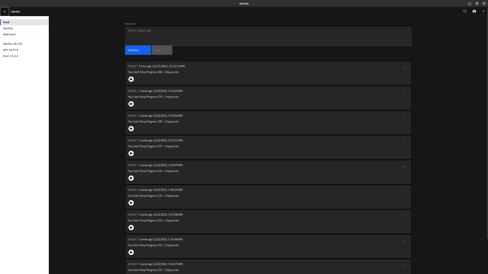
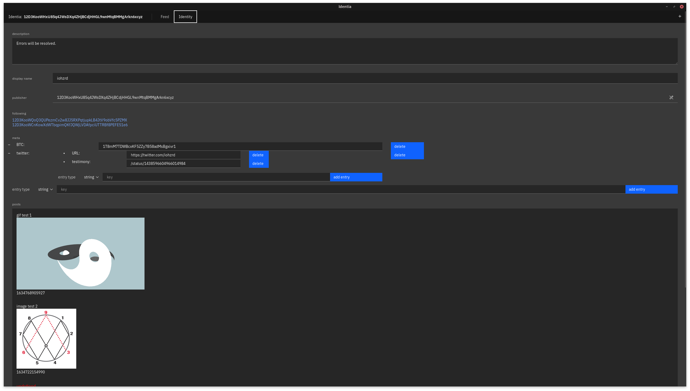

# identia

Decentralized, censorship resistant social media on IPFS.

Successor to [follow](https://github.com/iohzrd/follow)




## Run

Follow [this guide](https://tauri.studio/en/docs/getting-started/intro) to setup dev dependencies...

```
npm install
npm start
```

## Architecture

The core of identia is it's conception of an identity.

An identity object is the fundamental unit that we'll use to bootstrap a distributed multi-media social graph.

First, we connect to IPFS and retrieve our IPFS ID.

On first boot, we instantiate a new "Identity" object, which is ultimately stored and updated to disk via SQLite.

Most of the identity logic is contained in:
`src-tauri/identity.rs`

### The identity object:

```
{
    "avatar": "", // base64 encoded image or ipfs CID for "avatar"
    "description": "", // user-defined description / bio
    "display_name": "", // user-defined display name
    "following": [""], // a list of ID's the user follows
    "meta": {}, // graph time!
    "posts": [""], // a list of CIDs that represent post objects
    "publisher": "", // users IPNS ID
    "timestamp": 1608271880058, // UTC adjusted UNIX timestamp of the identities last alteration
}
```

### The post object:

```
{
    "body": "", // the text body of the post
    "files": [], // a list of file paths, relative to the post root
    "meta": {}, // graph time!
    "publisher": "", // original publisher, will be used for "re-post" functionality
    "timestamp": 1608271880058 // UTC adjusted UNIX timestamp of the post
}
```

### The meta object:

```
{"TODO": "so many things to do..."}
```

The meta object is a store for arbitrary data that can be used to describe complex relationships between various types of data.
These relationships can be stored in a post object to add context to a specific post or in the identity object to provide an identity-wide context scope.

## TODO

- [x] prototype logic
- [x] periodically re-publish self identity
- [x] periodically update identities you follow...
- [x] cache posts
- [x] enable file in posts
- [x] bundle IPFS binaries and manage execution
- [x] post view
- [x] implement tray.
- [x] progress events for spinners and such
- [x] Distribute binaries
- [x] migrate to SQLite...
- [x] Paginate feed
- [x] enable(fix) audio/video playback
- [ ] "re-post" / mirror a post
- [ ] implement comment system via pubsub
- [ ] strip exif data from images
- [ ] include index.html with posts to allow styling for browser consumption...
- [ ] Auto-update system
- [ ] advanced pin management
- [ ] meta view
- [ ] settings view
- [ ] implement private messaging via pubsub + libsignal
- [ ] mechanism for exporting / importing, identity / posts
- [ ] keybase-like functionality...
- [ ] mobile app...
- [ ] re-imlpement tor hidden service
- [ ] serve web-frendly html with identity + TOR
- [ ] integrate [DiscoCrypto](https://discocrypto.com/#/) into IPFS

## Community:

```
Matrix:
#general:identia.io

Discord:
https://discord.gg/aErhA6TBPS
```

## Follow me

```
12D3KooWHxU85q4JWsDXq4ZHjBCdjHHGL9wnMtqBMMgArkn6xcyz
12D3KooWDED1CudLX9sdi1qBzy5tHS4Xi2Mpk45E5wrqteri1R8z
12D3KooWQoQ3QUPezmCv2w8JJ5RXPqtjupkLB4JtV9obVfc5PZMX
```

## Support me

```
BTC:
bc1qtss3kxqcfl7glaskys7tevs98e6v62rhpx8lzj

XMR:
45TMU8YyJD7XCZXRGFUL3bGrgqnA2BrqWXbt9GTWGzCZ43e2fKBVowFintAzn5CsQA4S3MiHagCk22FP1L3meQJQF94PWE3
```

or

https://www.patreon.com/iohzrd

## License

[AGPL-3.0](LICENSE)
