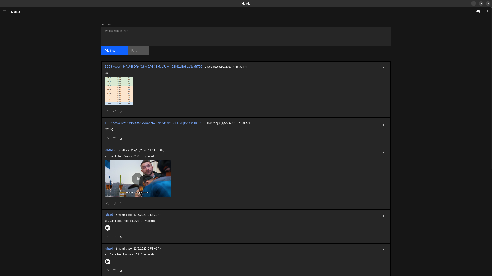

# identia

Decentralized, censorship resistant social media on IPFS. Plus experimental RSS reader.

Successor to [follow](https://github.com/iohzrd/follow)



## Development / Running from source

Follow [this guide](https://tauri.studio/v1/guides/getting-started/prerequisites) to setup dev dependencies...

### Linux

For video playback on linux, you may need to manually install gstreamer/gst-plugins:
`gstreamer gst-libva gst-plugins-bad gst-plugins-base gst-plugins-good gst-plugins-ugly`

For hardware video acceleration install: `gstreamer-vaapi`. Optional but recommended.

```
npm install
npm start
```

## Architecture

### The identity object:

```
{
    "avatar": "", // base64 encoded image or ipfs CID for "avatar"
    "description": "", // user-defined description / bio
    "display_name": "", // user-defined display name
    "following": [""], // a list of ID's the user follows
    "meta": {}, // graph time!
    "posts": [""], // a list of CIDs that represent post objects
    "publisher": "", // users IPNS ID
    "timestamp": 1608271880058, // UTC adjusted UNIX timestamp of the identities last alteration
}
```

### The post object:

```
{
    "body": "", // the text body of the post
    "files": [], // a list of file paths, relative to the post root
    "meta": {}, // graph time!
    "publisher": "", // original publisher, will be used for "re-post" functionality
    "timestamp": 1608271880058 // UTC adjusted UNIX timestamp of the post
}
```

### The meta object:

```
{"TODO": "so many things to do..."}
```

The meta object is a store for arbitrary data that can be used to describe complex relationships between various types of data.
These relationships can be stored in a post object to add context to a specific post or in the identity object to provide an identity-wide context scope.

## TODO

- [x] prototype logic
- [x] periodically re-publish self identity
- [x] periodically update identities you follow...
- [x] cache posts
- [x] enable file in posts
- [x] bundle IPFS binaries and manage execution
- [x] post view
- [x] implement tray.
- [x] progress events for spinners and such
- [x] Distribute binaries
- [x] migrate to SQLite...
- [x] Paginate feed
- [x] enable(fix) audio/video playback
- [ ] re-implement comment system via pubsub
- [ ] implement image(media) board system via pubsub
- [ ] implement custom IPFS in rust-libp2p
- [ ] mobile...
- [ ] "re-post" / mirror a post
- [ ] include crypto signature of body in post
- [ ] mechanism for exporting / importing, identity / posts
- [ ] strip exif data from images
- [ ] include index.html with posts to allow styling for browser consumption...
- [ ] Auto-update system
- [ ] advanced pin management
- [ ] meta view
- [ ] settings view
- [ ] keybase-like functionality...

## Follow me

```
12D3KooWHxU85q4JWsDXq4ZHjBCdjHHGL9wnMtqBMMgArkn6xcyz
```

## Support me

```
BTC:
bc1qtss3kxqcfl7glaskys7tevs98e6v62rhpx8lzj
```

or

https://www.patreon.com/iohzrd

## License

[AGPL-3.0](LICENSE)
